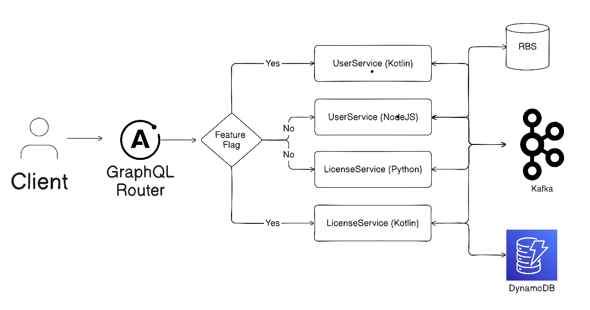
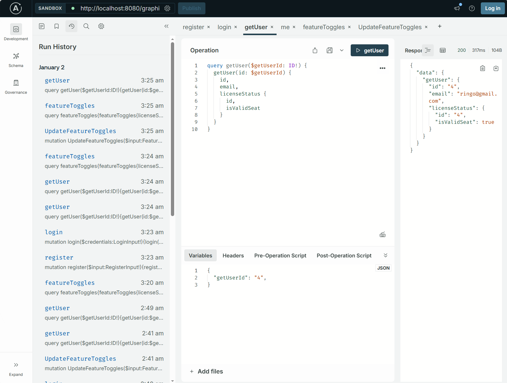

# Migration Demo 
The ask is to keep the backend system running amid development of new microservices and slowly phrase out the existing one. Some challenges:
1. Zero downtime migration of live traffic
2. Maintenance overhead, we will have multiple codebase that handle the same domain but with different technology. 
3. Data consistency, Since we are migration to a new type of data storage (dynamoDB), we will need to make sure both legacy and new microservice return the same data. 

On a high level, we can make it happen by using below:
- Feature Flag
- Event Driven Development 

Expanding on the architecture diagram supplied, we will have something like below in our migration journey:


## The Plan

### Phase 1: Parallel Run
* Prepare Script to migrate data from SQL to DynamoDB
* Keep Legacy Services Active
* Introduce Kafka to legacy microservice (if not present)
* Develop and Deploy new service 
* Introduce Feature Flag in GraphQL, now we should have ability to route traffic to new vs legacy microservices base on feature flag that are togglable at run time
* Flag should be off during this time in PRODUCTION
* Actively monitor and validate Data consistency

During this phrase, we will be hands on with both legacy and new microservices and retrofit them to perform **dual write**. 
1. This is done by emitting a message when write operation occurs in either side of the microservice
2. Both side will be listening for the write event and perform a write to their respective db
> With caveat to the legacy microservice, as it already writes to the db in a sync operation, we will not be changing that. Instead we will just omit the write if the source of the message is from itself.    

Once QA confirm microservice in old and new return the same dataset, we can move on to phrase 2

### Phrase 2: Gradual Cutover 
* If we are using a more competent feature flag toggle, this is where we will route users to our new endpoint
* Monitor performance
* Continue to QA and validate Data consistency

Since we are dual writing to both database, if any issue occur, we can toggle feature flag and rollback immediately without downtime. 

### Phase 3: Full Migration
* Turn on feature flag for ALL
* Monitor performance
* Continue to QA and validate Data consistency

We reach our finish line here, at this point we have done our migration... except we have more 1 phrase todo. Wait for 1 ~ 2 weeks  

### Phrase 4: Decommission old resources
* Remove Feature flag and related logic
* Decomission legacy microservice
* Archive old DB

And we are done! 

## Assumptions
Every plan has some assumption, I wrote down few below:
* Client is already using existing Federated GraphQL endpoints
* Kafka already exist and existing Microservice does not have problem adopting to it. 
* Domain data structure is similar in legacy VS New, both microservice should be able to supply information below from their respective DB.
```
User 
  id: ID!
  email: String!
  username: String!
  role: String!

LicenseStatus 
  id: ID!
  UserId: string
  isValidSeat: Boolean!
  seatType: String
  expirationDate: String
```
* Since we are using event driven architecture, there are bound to be lag between when request is complete and to when data is written in the db 

## Development

### Getting Started

This project uses Docker Compose to orchestrate all services. To start the entire stack:

```bash
docker-compose up
```

This will start all services including:
- **GraphQL Gateway** (port 8080) - Main entry point with GraphiQL interface

- **Kafka UI** - Kafka management interface (port 8081)

### GraphiQL Interface

Once the services are running, access the GraphQL Gateway's GraphiQL interface at:
**http://localhost:8080**

From GraphiQL, you can:
- Explore the GraphQL schema
- Execute queries and mutations
- View feature toggle state
- Switch between legacy and new services using the `updateFeatureToggles` mutation

### Example Queries

**Check feature toggle state:**
```graphql
query {
  featureToggles {
    userService
    licenseService
  }
}
```

**Login:**
```graphql
mutation {
  login(credentials: { email: "john.doe@example.com", password: "password123" }) {
    token
    user {
      id
      email
      username
      role
    }
  }
}
```
There are queries that require Authentication, in order for you to access them, you will need to supply the token from above and put it in the header as bearer token 
**Get user with license status:**
```graphql
query {
  getUser(id: "1") {
    id
    email
    username
    role
    licenseStatus {
      isValidSeat
      seatType
      expirationDate
    }
  }
}
```

### Feature Toggles
Control which services are active using the `updateFeatureToggles` mutation:

```graphql
mutation {
  updateFeatureToggles(input: {
    userService: true
    licenseService: true
  }) {
    userService
    licenseService
  }
}
```
### Kafka UI

Monitor Kafka events and topics at:
**http://localhost:8081**

## Misc/Todo?
Due to time constraint there are things that occupied my mind but don't have time to implement, with no particular order
1. Integration test, It would be nice to run through different kind of scenarios with feature toggle switching in runtime, most of the verification is done via GraphiQL and manaul testing
2. More unit test... 
3. Current Apollo GraphQL implement is not true federation, but implementation swap, would be nice to handle actual subgraph swaps
4. Feature toggles is done in memory, given this is a demo, I think it is sufficient?
5. Logs, logs everywhere!
6. Security! Password should be hash protected. Microservice does not need to be exposed to public network (left open for ease of debug), token refresh etc...
7. Caching
8. Implementation of DynamoDB, I added the reference but ran out of time to implement and test it
9. More endpoints? I only supplied limit endpoint, and non of them return a list of objects. For example, if I have to write an endpoint with a list of users... we will most likely need to watch out for N+1 which can easily happen in GraphQL. For that we will need to write `dataloader` to handle it. Ran into this problem before in my previous role.   
